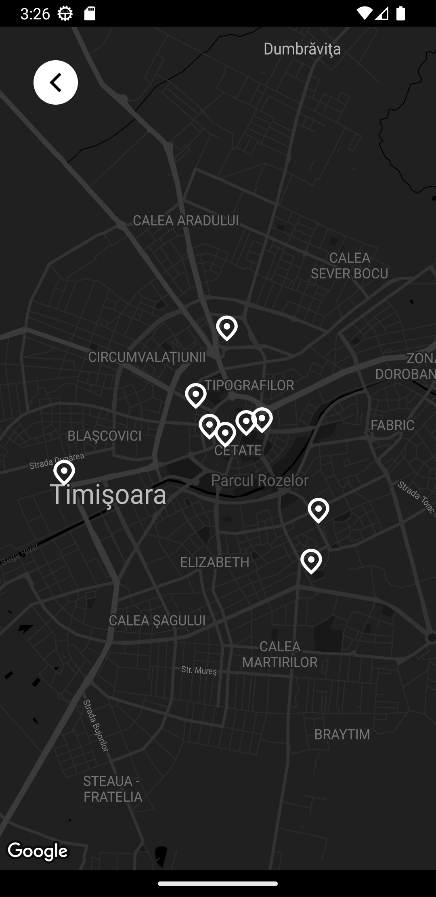
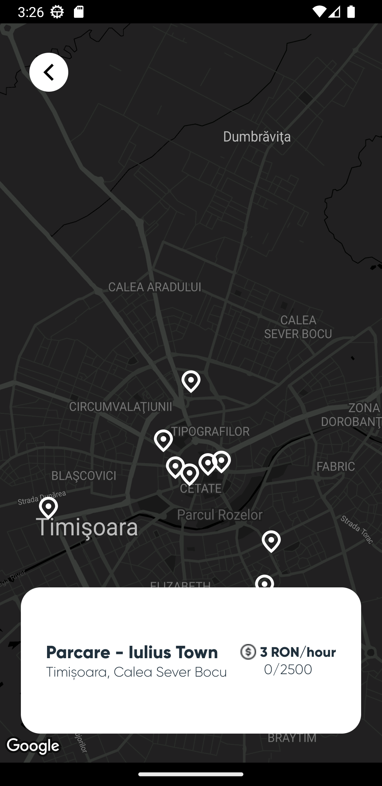
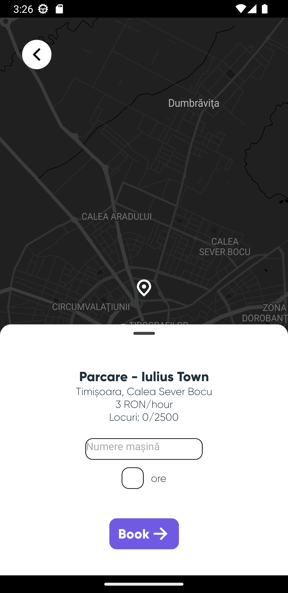

# Find My Spot

---

## Piratzii - Hackathon - 1st Edition

Have you ever spent what feels like an eternity looking for a parking spot? How many times have you been late to work or school simply because you couldn't find one?

Say less... This minimalist Parking Space Finder app allows users to book a spot in a specific parking lot in real time.

This is what you see when you open the app.

<View align="center">
    
</View>

Once you press the button, you enter the Map where you can see all the parking lots.

    
    
    

The final product:

    

---

This was mine and my partner, Silvia's, first hackathon. Even though we didn't meet all of our goals for this app, this experience was a good practice and great learning opportunity for the both of us, especially for Silvia since it was her first interaction with React Native, Strapi and GraphQL. &#x1F60A
